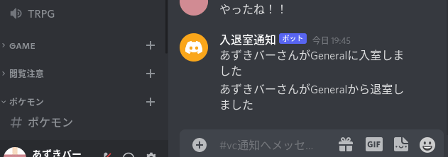

# はじめに

私は所属しているサークル([電気通信大学工学研究部](https://www.koken.club.uec.ac.jp))の活動や、親しい友人との会話などに Discord を活用しています。

Discord のボイスチャット機能は遅延も少なく機能もたくさんあってかなり好きです。

しかし 1 つだけ気にいらないものがありました。それはチャットルームに入室しても誰も来てくれないことです。(人望が無い訳ではない。多分。。きっと。。。おそらく。。。)

入退室に通知を付ければ、その通知を見た人が参加してくれるのでは無いかと考え、そのようなボットを作成しました。

# どのように動くの？

以下のように動きます。



入室、部屋の移動、退室に対し通知が送られます。内容は以下のようになっています。

## 通知の内容

### 入室

```
<ニックネーム>さんが<ルーム名>に入室しました
```

### 部屋移動

```
<ニックネーム>さんが<ルーム名1>から<ルーム名2>へ移動しました
```

### 退室

```
<ニックネーム>さんが<ルーム名>から退室しました
```

# セットアップの方法は？

[Discord Developer Portal](https://discord.com/developers/applications)にアクセスしてトークンを取得してください。

適当なサーバを用意して docker-compose を入れてください。

下の`docker-compose.yml`ファイルを用意して`docker-compose up -d`で起動して下さい。

```yaml
version: '3'
services:
  server:
    image: ghcr.io/azuki-bar/discord-vc-notify:latest
    environment:
      TOKEN: "YOUR TOKEN"
      CHANNEL_ID: "NOTIFY CHANNEL ID"
```

## `systemd`で管理する

僕は`systemd`が好きです。 `systemd`で管理出来るものはなるべく`systemd`で管理したい。
そういう思いがあるのでこの Bot も`systemd`で管理しています。

以下のファイルを`/etc/systemd/system/discord-vc-notifier.service`という名前で保存します。

```conf
[Unit]
Description=discord voice chat notifier.

[Service]
ExecStart=docker-compose -f /INSTALL_DIR/docker-compose.yml up
ExecStop=docker-compose -f  /INSTALL_DIR/docker-compose.yml down
ExecReload=docker-compose -f /INSTALL_DIR/docker-compose.yml restart
Restart=always

Type=simple

[Install]
WantedBy=multi-user.target
```

起動するには以下のコマンドを実行します。

```
sudo systemctl daemon-reload
sudo systemctl start discord-vc-notifier
sudo systemctl enable discord-vc-notifier
```

その他、詳しいことは`man systemd.service` などでご覧ください。

# 開発にあたって

ここからはポエムです。

この Bot は工学研究部の Discord チャンネルをもっと活発にしたいという考えから作成されたものです。

Bot 自体は結構前に作成したのですが、Pipenv をシェルスクリプトにて直接叩くという褒められた実装ではありませんでした。

そこで、GitHub Actions で遊ぶのも兼ねて Docker イメージをビルドし、GitHub Container Registory と Docker Hub にアップロードしてあげることにしました。

GitHub Actions の計算機資源（厳密には Microsoft Azure の計算機資源）を無駄に食い潰して遊んでごめんなさい。

# さいごに

ぜひお手持ちのサーバで遊んであげてくださいね。

[GitHub](https://github.com/Azuki-bar/discord-vc-notify)

[GitHub Container Registry](https://github.com/Azuki-bar/discord-vc-notify/pkgs/container/discord-vc-notify)

[Docker Hub](https://hub.docker.com/repository/docker/azukibar/discord-vc-notify)
